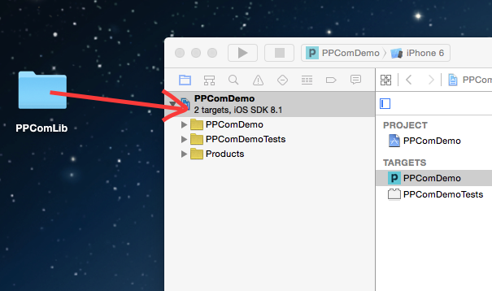
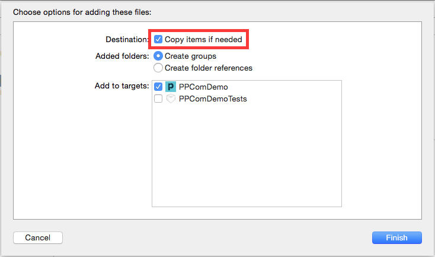
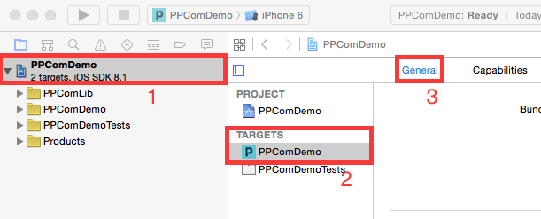
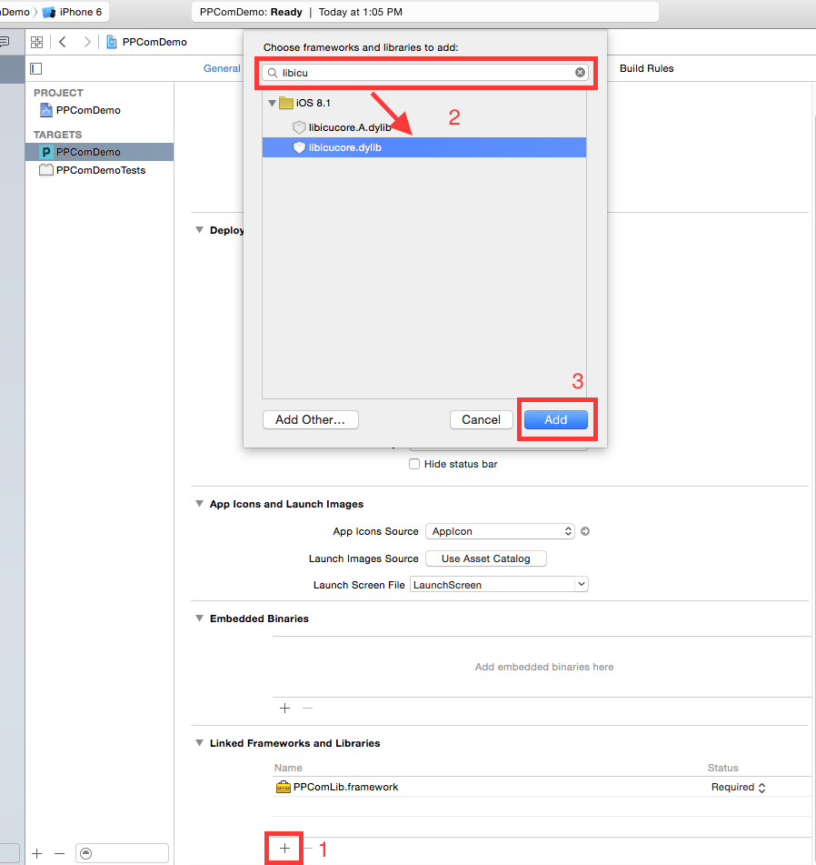

# 怎样在项目中集成并使用 `PPComLib`

## 在项目中集成 `PPComLib`

下面以 `PPComDemo` 演示如何导入 `PPComLib` 进行集成

### 步骤一
将下载到的`PPComLib.zip`进行解压，假设解压之后放到了桌面上，接着直接拖动`PPComLib`整个文件夹到你的`Project`中去。如图所示：



### 步骤二
松开鼠标之后，XCode将会提示你设置一些拷贝信息，这个时候记得勾选上 `Copy items if needed` 前面的对号。如图所示：



### 步骤三
选择 "TARGETS" 下面的 "PPComDemo"，切换到 "General"面板。如图所示：



### 步骤四
添加动态链接库 `libicucore.dylib` 或者 `libicucore.tbd` 到你的 Project 中去。在 General 面板中，点击最下面的 "+" 号，在弹出的对话框中搜索 "libicucore.dylib" 或者 "libicucore.tbd" ，然后点击 "Add" 按钮添加至你的项目中去。



### 步骤五
修改项目编译参数。根据下图提示的 1、2、3、4 步骤，找到 `Other Linker Flags` 选项，然后双击进行修改，添加上 `-ObjC -all_load` 参数。至此，就可以在项目中使用 `PPComLib` 了。


## 在项目中使用 `PPComLib`

`PPComLib` 提供了两个 `UIViewController`: `PPViewController` 和 `PPMessagesViewController`。其中 `PPViewController` 用于显示会话列表，`PPMessagesViewController` 用于显示单条具体会话的聊天内容。使用的时候直接继承 `PPViewController` 即可。

如 `PPComDemo Project` 中的 `FeedbackViewController.h` 所示，`FeedbackViewController` 继承了 `PPViewController`。

```objective-c
#import <PPComLib/PPViewController.h>

@interface FeedbackViewController : PPViewController

@property (nonatomic, weak) id<FeedbackViewControllerDelegate> delegateModal;

@end
```

然后在 `FeedbackViewController.m` 中重写 `viewDidLoad` 方法，在该方法内配置 `PPViewController` 所需要的参数：`appKey`, `appSecret`。最后通过调用 `initializeWithUserEmail` 方法使用已知用户来初始化 `PPViewController`（或者通过调用 `initialize` 方法使用匿名用户来初始化 `PPViewController`）。代码如下所示：

```objective-c
- (void)viewDidLoad {
    [super viewDidLoad];
    
    // set your appKey
    self.appKey = APP_KEY;
    // set your appSecret
    self.appSecret = APP_SECRET;
    // initialize with user_email or call `[self initialize]` to initialize with anonymous user.
    [self initializeWithUserEmail:USER_EMAIL];
    
    // custom
    self.title = @"Feedback";
}
```

当使用 `Show(Push) Segue` 来打开 `FeedbackViewController` 的时候，用户点击左上角的返回按钮，此刻将会自动释放 `PPComLib` 的资源。但是当使用 `Modal` 方式来打开 `FeedbackViewController` 的时候，用户点击关闭按钮来退出当前界面，`PPComLib` 并不会自动释放资源，所以需要监听关闭按钮事件来手动释放资源（忘记释放的话，会引发异常）。所以当你以 `Modal` 方式打开的话，在关闭按钮的事件中千万不要忘记释放 `PPComLib` 的相关资源。如下所示：

```objective-c
- (void)viewWillAppear:(BOOL)animated {
    [super viewWillAppear:animated];
    
    if (self.delegateModal) {
        self.navigationItem.leftBarButtonItem = [[UIBarButtonItem alloc] initWithBarButtonSystemItem:UIBarButtonSystemItemStop
                                                                                              target:self
                                                                                              action:@selector(onClosePressed:)];
    }
}

- (void)onClosePressed:(UIBarButtonItem *)sender {
    //通过自定义关闭按钮事件的时候，不要忘记释放资源
    [self releaseResources];
    [self.delegateModal didDismissFeedbackViewController:self];
}
```

至此，你已经可以项目中使用 `FeedbackViewController` 了。

但是，如果你想监听聊天界面的用户点击聊天图片或者点击文件事件的话，那么需要继承 `PPMessagesViewController` 进行定制设置你自己的监听事件了（默认用户点击聊天图片或者文件等，不作任何事件处理）。在 `FeedbackViewController` 中，通过重写 `getPPMessageListViewControllerClass` 方法来告诉 `PPViewController` 你新的定制类是什么，如下所示：

```objective-c
- (Class)getPPMessageListViewControllerClass {
    return [FeedbackMessagesViewController class];
}
```

`FeedbackMessagesViewController` 实现了 `PPMessagesViewControllerDelegate` protocol 协议，然后监听用户点击聊天图片和点击文件的事件。如下所示：

在 `FeedbackMessagesViewController.h` 引入头文件：

```objective-c
#import <PPComLib/PPMessagesViewController.h>

@interface FeedbackMessagesViewController : PPMessagesViewController

@end
```

在 `FeedbackMessagesViewController.m`实现： 

```objective-c
@interface FeedbackMessagesViewController () <PPMessagesViewControllerDelegate>

@end

@implementation FeedbackMessagesViewController

- (void)viewDidLoad {
    [super viewDidLoad];
    self.delegate = self;
}

- (void)onFileMessageTapped:(NSURL *)fileUrl {
    NSLog(@"FeedbackMessagesViewController-onFileMessageTapped-fileUrl:%@", fileUrl);
}

//Note: displayedImage may be empty
- (void)onImageMessageTapped:(NSURL *)imageUrl image:(UIImage *)displayedImage {
    NSLog(@"FeedbackMessagesViewController-onImageMessageTapped-imageUrl:%@", imageUrl);
}

@end
```

开发者可参考附件中提供的 `PPComDemo Project` 来进行更详细的集成了解。